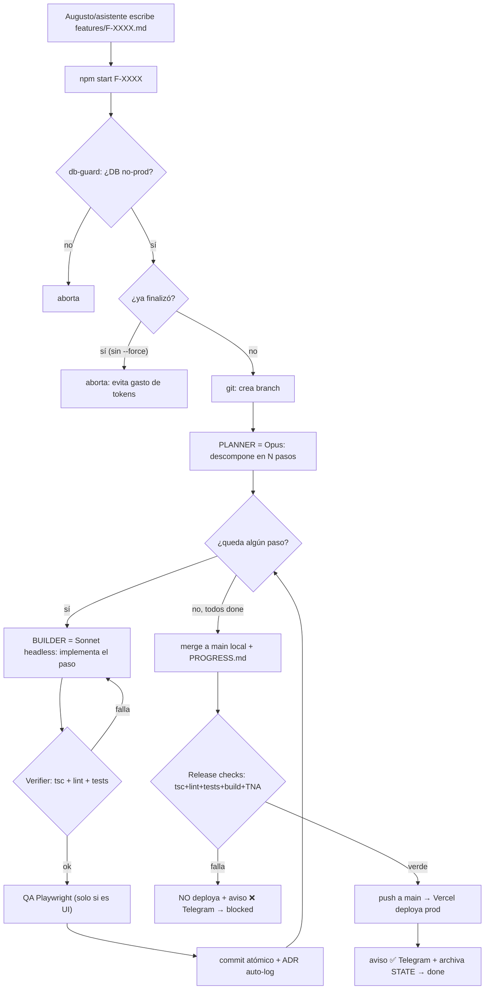

# Arquitectura actual del sistema de agentes (augusto-os) — estado real al 2026-06-25

> Descripción de la implementación REAL (no ideal). Basada en el código del orquestador: `orchestrator/src/{index,planner,executor,verifier,qa,gates,db-guard,adr,telegram,state,git,targets}.ts`.

## Aclaración central (lo que más se malinterpreta)

**No hay un "agente orquestador" LLM que coordine.** La coordinación la hace **código determinístico**: un state machine en TypeScript (`index.ts`) que corre con `npm start F-XXXX`. Ese loop es el director de orquesta, pero no piensa: ejecuta una secuencia fija.

**Solo existen DOS agentes LLM reales:**
1. **Planner = Opus** — descompone la feature en pasos.
2. **Builder/Executor = Sonnet** (vía Claude Code headless) — implementa cada paso.

Todo lo demás (verifier, QA, guard, gates, sync, ADR, Telegram) es **código determinístico**, no agentes.

## Agentes y componentes — responsabilidad de cada uno

| Componente | Qué es | Responsabilidad |
|------------|--------|-----------------|
| **Augusto (PO)** | Humano | Escribe el feature spec `features/F-XXXX.md` (o lo escribe su asistente estratégico). Es el origen de toda tarea. |
| **Loop / coordinador** (`index.ts`) | Código (state machine) | Coordina TODO: lee el spec, llama al Planner, itera los steps llamando al Builder, corre Verifier y QA, commitea, mergea, corre release checks y deploya. **No es un LLM.** |
| **Planner** (`planner.ts`) | **Opus** | Una sola vez al inicio: descompone el spec en N pasos atómicos. |
| **Builder/Executor** (`executor.ts`) | **Sonnet** (Claude Code headless) | Por cada paso: implementa el cambio de código. Hasta 3 reintentos con el error como feedback. |
| **Verifier** (`verifier.ts`) | Código | Tras cada paso: `tsc --noEmit` + lint + tests. Al final: battery completa (typecheck + lint + tests + `build` de prod + escaneo de fuga de TNA). Es el "revisor" automático. |
| **QA** (`qa.ts`) | Código (Playwright) | Solo en pasos de UI: screenshots/verificación visual. Degrada si no hay server. |
| **db-guard** (`db-guard.ts`) | Código | Pre-vuelo: aborta si la DB del loop apunta a producción. |
| **Command hook** (`pre-tool-use.sh` / `checkHumanGate`) | Código | Bloquea comandos peligrosos reales (prisma migrate, deploy, drop, truncate) en ejecución. |
| **ADR auto-log** (`adr.ts`) | Código | Escribe en `DECISIONS.md` las decisiones de diseño que el Builder emite, con su Origen (instrucción vs. supuesto). |
| **Bot Telegram (AlantORCH)** (`telegram.ts`) | Código | Avisa el deploy (✅) o el error si falla (❌). Recibe ideas con `/idea` → `FEATURE-INTAKE.md`. |

## Respuestas directas

- **¿Quién recibe primero una idea o fix?** Hoy es **manual**: Augusto (o su asistente estratégico) escribe el `features/F-XXXX.md`. Las ideas que llegan por Telegram `/idea` caen en `FEATURE-INTAKE.md` (una cola), pero **NO se convierten en spec automáticamente** — eso sería el "Architect agent", que **todavía no existe**.
- **¿Quién planifica?** El **Planner (Opus)**, una vez, al arrancar el feature.
- **¿Quién ejecuta?** El **Builder (Sonnet headless)**, paso por paso.
- **¿Quién coordina a los demás?** El **loop (`index.ts`)** — código determinístico, no un LLM.
- **¿Quién revisa el resultado?** El **Verifier** (automático: tsc + lint + tests + build). **NO hay un agente Reviewer LLM independiente** — eso es Fase 1b, planificado pero **no implementado**.

## Flujo de una tarea (prompt → done)

1. Augusto/asistente escribe `features/F-XXXX.md`.
2. `npm start F-XXXX` arranca el loop.
3. **db-guard**: confirma DB no-prod (si no, aborta).
4. **Guard anti-reejecución**: si el feature ya finalizó, aborta (salvo `--force`) para no gastar tokens.
5. **Git**: crea la feature branch.
6. **Planner (Opus)**: descompone el spec en N pasos.
7. Por cada paso:
   a. (Gate humano por-step: hoy **auto-aprobado**, sin frenar — ADR-0019.)
   b. **Builder (Sonnet)** implementa el paso (hasta 3 reintentos).
   c. **Verifier**: tsc + lint + tests. Si falla → reintenta el Builder con el error.
   d. Si es paso de UI → **QA** (Playwright).
   e. **Commit atómico** + ADR auto-log si el Builder emitió decisiones.
8. Todos los pasos done → **merge** de la branch a `main` (local) + se appendea `PROGRESS.md`.
9. **Release checks**: tsc + lint + tests + build + chequeo de fuga de TNA.
10. Si **verde** → push a `main` → Vercel **deploya a prod** → aviso ✅ por Telegram → **done** (archiva STATE). Si **falla** → NO deploya → aviso ❌ con el error por Telegram → queda `blocked`.

## Diagrama del flujo actual

## Lo que NO existe todavía (explícito)

- **No hay agente Reviewer LLM independiente.** La "revisión" es solo verificación automática (tsc/lint/tests/build). El Reviewer que lee el diff antes del commit es **Fase 1b — pendiente**.
- **No hay Architect agent.** El paso idea→spec es manual; las ideas de Telegram quedan en una cola sin triage automático. **Pendiente (S-008).**
- **No hay routing multi-modelo.** Opus planifica, Sonnet ejecuta; no hay modelos baratos (DeepSeek/GLM) en el Builder todavía. **Pendiente (S-014).**
- **El coordinador NO es un LLM** — es un state machine determinístico. No hay "razonamiento" en la coordinación.
- **No hay paralelismo.** Es secuencial: un paso a la vez, un feature a la vez. No hay múltiples agentes trabajando en simultáneo.
- **Gating por estado operativo (SLEEP/OFFICE/PRODUCT)** se lee de un archivo pero el comportamiento por modo casi no está enforced. **Fase 2 — pendiente.**
- **Dashboard web / visualización del equipo** — pendiente (S-007).
